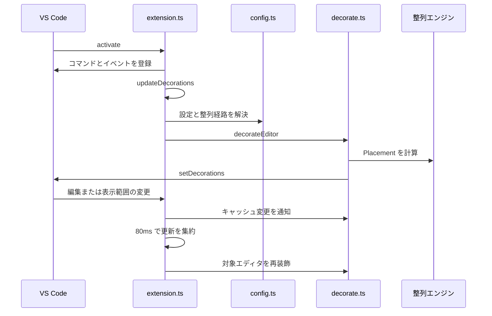

# 実行時アーキテクチャ

Ghost Align は文書を編集しない表示拡張です。`src/extension.ts` が VS Code のライフサイクルを受け、`src/config.ts` が経路を決め、`src/decorate.ts` が各整列器の結果を `TextEditorDecorationType` に適用します。整列の共通出力である `Placement` は、表示装飾とコピー機能を同じ計画に接続します。

## 起動から再描画まで

*起動後は可視エディタだけを対象にし、編集・設定・スクロールに応じて再計算します。*

`activate(context)` は整列と URL 短縮の装飾タイプ、全言語対象の `DocumentLinkProvider`、3 コマンド、各種イベントを登録します。グローバル ON/OFF は `workspaceState` を優先し、旧来の `globalState` をフォールバックにして復元します。`ghostAlign.toggle` が OFF のときは全装飾を消去し、`deactivate()` も同じ消去を行います。

- 文書編集時は CSV、Markdown、行スキャン、長大演算子グループの各キャッシュへ変更を通知し、その文書を表示するエディタだけを再装飾します。
- 編集・選択・オプション変更などの高頻度イベントは 80 ms の `debounce` で集約します。
- 10,000 行以上の文書だけは可視範囲の変更でも再描画します。小規模文書は全文を装飾するため、スクロールを契機にしません。
- `isAlignableScheme()` は `file`、`untitled`、`vscode-remote`、`vscode-vfs`、`vscode-notebook-cell` の allowlist で対象を限定します。

これらのイベント処理は、[整列機能と非破壊コピー](../workflows/alignment.md) が説明する経路の結果を描画するだけで、`TextDocument` への編集は行いません。変更時の統合テスト手順は [開発、テスト、パッケージ、リリース](../operations/contributing.md) に従います。

## 設定から整列経路へ

`resolveAlignmentPath(languageId, config)` は、装飾とコピーが別々の分岐を持って挙動がずれないようにする中央ディスパッチです。

| 優先順 | 条件 | 結果 | 主な実装 |
| --- | --- | --- | --- |
| 1 | `languageId` が `markdown` | `markdown` または `none` | `src/markdown.ts` |
| 2 | `ghostAlign.csv.delimiters` に言語 ID がある | `csv` または `none` | `src/csv.ts` |
| 3 | それ以外 | `operators` | `src/finders.ts`, `src/paddings.ts` |

`disabledLanguages` は装飾を言語単位で止めます。演算子経路では `operatorsByLanguage` がグローバル `operators` より優先され、未登録言語へのフォールバックは `alignUnknownLanguages` で止められます。TS/JS 系では `jsdoc.enabled` が有効なら JSDoc 配置を追加します。feature 単位の enabled 設定は旧設定キーへの明示的なフォールバックを持ち、互換性を保ちます。

設定を増減する場合は `package.json` の `contributes.configuration`、`src/config.ts`、README、`docs/features/reference.md` を同時に扱ってください。`config.test.ts` が既定値やドキュメント索引の同期を検証します。設定別の変更起点は [ソースマップ](source-map.md) にあります。

## 配置計画と描画の境界

`computeDocumentPlacements()` が各経路の結果を共通の `Placement[]` に正規化します。`Placement` は行番号、文字位置、必要な余白数、必要時の `padChar` を持ちます。

- `decorateEditor()` は `Placement` を VS Code の `before.contentText` 装飾へ変換します。連続した ASCII 空白が Decoration API で畳まれないよう、通常のゴースト文字には NBSP を使います。
- `src/paddings.ts` の `visualColumn()` はタブ、全角文字、絵文字、結合文字を考慮して視覚的な列を計測します。`findAlignmentGroups()` と `computePaddings()` はインデント境界を持つ連続行をグループ化し、列ごとに余白を計算します。
- `buildCopyAlignedText()` は同じ計算結果を `src/copyAligned.ts` の `buildAlignedText()` へ渡し、装飾の代わりに ASCII 空白を挿入してクリップボードへ送ります。URL 短縮はライブ表示だけのため、コピー時の列幅は短縮前の全文を基準にします。

この共通モデルが [整列機能と非破壊コピー](../workflows/alignment.md) の「表示は非破壊、コピーだけが実スペース」という製品契約を支えます。

## 大規模文書とキャッシュ

可視範囲モードでも、同じ行群の整列先がスクロール位置で変わらないことが重要です。`LARGE_FILE_LINE_THRESHOLD` は 10,000 行で、経路ごとに文書全体の判断を保持しつつ描画量を制限します。

| 対象 | 保持する情報 | 変更時の扱い |
| --- | --- | --- |
| 演算子 | `LineScanCheckpointCache` の複数行スキャン状態 | 編集位置以降の状態を無効化 |
| 長大な演算子グループ | `LongOperatorGroupCache` の全グループ配置 | 文書変更で該当キャッシュを無効化 |
| Markdown | `MarkdownTableWidthCache` の表幅計画 | 編集範囲を通知して再計算 |
| CSV/TSV | `CsvWidthCache` の行メトリクスと列幅計画 | 変更行を dirty にして必要範囲を再走査 |

最近の #447 は、可視スライスの外に最大幅の行がある 2,000 行超の連続演算子グループで整列先が揺れる問題を修正しました。通常スライスが境界上限で切れているかを確認し、必要な場合だけ真のグループ全体で再計算して `LongOperatorGroupCache` に保存します。性能関連の変更は `decorate.test.ts` と `paddings.test.ts` の大規模文書ケースを必ず更新・実行してください。

実装ファイルと変更起点の対応表は [ソースマップ](source-map.md) を参照してください。
