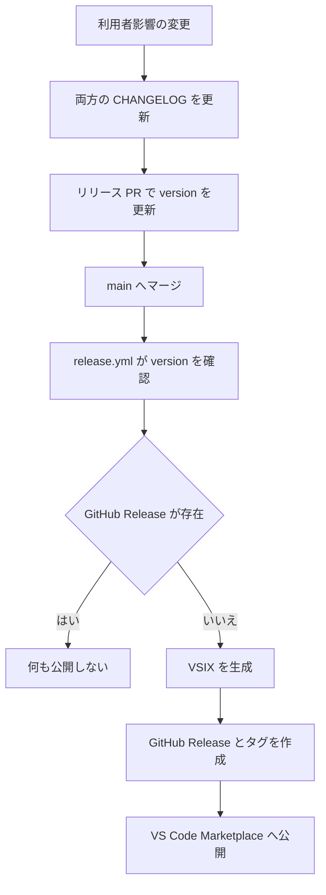

# 開発、テスト、パッケージ、リリース

このページは実装変更を安全に統合・配布するための実務ガイドです。変更する機能の処理は[整列機能と非破壊コピー](../workflows/alignment.md)、起動や性能の影響範囲は[実行時アーキテクチャ](../architecture/overview.md)、ファイルごとの入口は[ソースマップ](../architecture/source-map.md)を先に確認してください。開発手順の一次資料は `docs/CONTRIBUTING.md` です。

## ビルドとローカル確認

| 目的 | コマンド | 備考 |
| --- | --- | --- |
| 依存関係を再現可能に導入 | `npm ci` | CI と同じ導入方法 |
| 開発中のバンドル更新 | `npm run watch` | F5 の拡張デバッグ用 |
| 本番バンドル | `npm run build` | `out/extension.js` を生成 |
| 型チェックとテスト出力 | `npm run compile` | `out-tsc/test/**` を生成 |
| 型だけを確認 | `npm run check-types` | `tsc --noEmit` |
| Lint | `npm run lint` | `src`、`scripts`、`eslint.config.mjs` を対象 |
| 拡張統合テスト | `npm test` | Linux では `xvfb-run -a npm test` |
| スクリプト単体テスト | `npm run test:scripts` | `scripts/*.test.js` |
| VSIX 内容まで検証 | `npm run check:package` | allowlist と release の VSIX パスを照合 |

統合テストはコンパイル出力を読むため、クリーン環境では `npm run compile` を先に実行します。CI は PR と `main` への push で起動し、Node `24.x` で lint を Ubuntu、統合テストを Windows と Ubuntu のマトリクスで実行します。テストジョブの順序は `npm ci`、`npm run compile`、`npm run test:scripts`、`npm test`、`npm run check:package` です。

## 変更別のテスト

| 変更領域 | 主に更新するテスト | 重点 |
| --- | --- | --- |
| 設定・コマンド・互換性 | `config.test.ts`, `extension.test.ts` | `package.json`、README、`docs/features/reference.md` との同期 |
| 演算子検出・構文状態 | `finders.test.ts`, `paddings.test.ts` | 文字列、コメント、正規表現、複数行構文 |
| 装飾・可視範囲・キャッシュ | `decorate.test.ts`, `paddings.test.ts` | 大規模文書とスクロール安定性 |
| Markdown 表 | `markdown.test.ts`, `decorate.test.ts` | コードブロック、区切り行、URL |
| CSV/TSV | `csv.test.ts`, `decorate.test.ts` | RFC 4180、複数行クォート、数値列 |
| URL 短縮・リンク | `urlShorten.test.ts`, `csv.test.ts`, `markdown.test.ts`, `decorate.test.ts` | URL 境界、選択時の復元、クリック先 |
| コピー | `copyAligned.test.ts` | 選択範囲、EOL、Markdown 区切り行 |

バグ修正では該当 suite に最小再現を追加します。10,000 行以上で処理が変わるため、性能やグループ化の変更では通常サイズだけでなく可視範囲モードも検証してください。

## パッケージとリリース

`npm run package` は `dist/ghost-align.vsix` を生成し、`npm run install:vsix` はローカル VS Code へ強制インストールします。VSIX の内容は `.vscodeignore` と `scripts/check-package-contents.js` の `EXPECTED` により、`CHANGELOG.md`、`LICENSE`、`README.md`、`media/icon.png`、`out/extension.js`、`package.json` の 6 ファイルへ固定されています。配布物を変更する場合は両者を同じ変更で更新します。

*既存の `v<version>` Release を確認してから公開するため、通常の `main` 更新は重複リリースになりません。*

`.github/workflows/release.yml` は `main` への `package.json` 更新で起動します。`v<version>` GitHub Release がなければ、依存導入、コンパイル、VSIX 作成、英語版 `CHANGELOG.md` からのノート抽出、GitHub Release とタグの作成、Marketplace 公開を実行します。`VSCE_PAT` が未設定なら Marketplace 公開だけをスキップします。シークレット値は読んだり記録したりしません。`npm run prepare-release <x.y.z>` は CHANGELOG と version を書き換えるため、意図したリリース PR 上でだけ実行します。

## 文書と履歴の運用

`README.md` は Marketplace に公開される英語の利用者向け正本、`README.ja.md` は日本語版です。利用者に見える機能、設定、手順を変えたら両方を同期し、開発者向け説明は `docs/CONTRIBUTING.md` に置きます。`CHANGELOG.md` は英語の正本で、利用者影響があれば `CHANGELOG.ja.md` と同じ内容を `[Unreleased]` に追記します。

最近の #446 は URL のホストを実テキストで残して短縮表示し、CSV のクリック範囲を専用リンク provider で補正しました。#447 は長大な演算子グループを全体キャッシュし、スクロール位置で整列が揺れないようにしました。これらの変更は、[整列機能と非破壊コピー](../workflows/alignment.md) の製品契約と [実行時アーキテクチャ](../architecture/overview.md) の性能設計を同時に守る必要がある例です。
