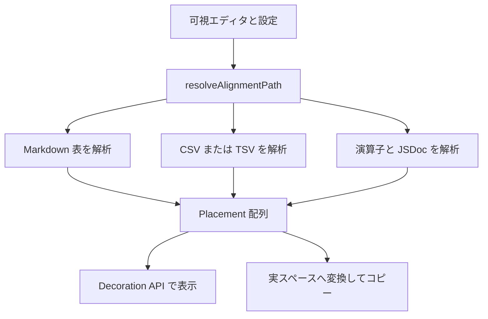

# 整列機能と非破壊コピーのワークフロー

Ghost Align の機能は異なる構文を扱いますが、いずれも「対象位置を見つける → 視覚列を揃える `Placement[]` を作る → 表示装飾またはコピー用文字列へ適用する」という骨格を共有します。実行時の入口と性能上の制約は [実行時アーキテクチャ](../architecture/overview.md) を参照してください。

## 共通フロー

*各経路は同じ配置形式へ合流し、文書を変更せずに表示またはコピー結果を作ります。*

`resolveAlignmentPath()` は `disabledLanguages` を最優先で確認し、Markdown、`ghostAlign.csv.delimiters` に登録された言語、通常の演算子という順で経路を選びます。設定の公開スキーマは `package.json`、防御的な解決は `src/config.ts` にあり、既定値の同期は `config.test.ts` で守られます。変更の起点は [ソースマップ](../architecture/source-map.md) を確認してください。

## 演算子と JSDoc

`findOperatorTargets()` は設定順に演算子列を検出します。文字列・コメント・正規表現を除外し、`LineScanState` で block comment、template literal、Python triple quote、Ruby/PHP heredoc、CSS ブロック、YAML block scalar などを行をまたいで管理します。新しい構文規則を追加する場合は、単純な文字列検索へ退行させず、状態走査・大ファイル slice・`finders.test.ts` を一緒に更新してください。

`findAlignmentGroups()` は連続行を通常はインデントの表示幅で分け、`visualColumn()` がタブ、全角文字、絵文字、結合文字を含めて幅を測ります。`computePaddings()` は左側の列で追加した余白を後続列へ繰り越します。`ghostAlign.maxPadding` を使う演算子／JSDoc 経路では、過剰な余白を要する右側の外れ値行をその列から外し、残る行を整列します。

JavaScript / TypeScript では `src/jsdoc.ts` が連続する `@param`、`@property`、`@arg`、`@argument` の名前列と説明列を追加整列します。`ghostAlign.jsdoc.enabled` が未設定なら、旧設定 `ghostAlign.alignJsdocParams` を互換フォールバックとして尊重します。

## Markdown と CSV/TSV

`src/markdown.ts` は有効な GFM 区切り行を持つ表だけを認識し、インラインコード、エスケープ済み `|`、フェンス／インデントコードブロックを除外します。区切り行は有効な構文を保つため `-` で幅を埋めます。

`src/csv.ts` は一文字の区切りと RFC 4180 形式のダブルクォート、`""` エスケープ、複数物理行にまたがるクォート済みセルを処理します。`ghostAlign.csv.alignNumbersRight` はすべてのデータセルが `-?\d+(\.\d+)?` に見える列だけを右寄せにし、小数がある列は小数点位置を揃えます。

表経路では `maxPadding` の意味が異なります。行を捨てると後続列の形が壊れるため、長いセルを含む**列全体**を整列対象外にします。大ファイルでは `MarkdownTableWidthCache` と `CsvWidthCache` が全文幅を保持し、可視範囲だけを描画しても列位置を安定させます。このキャッシュ戦略は [実行時アーキテクチャ](../architecture/overview.md) の大規模文書設計に依存します。

## URL 短縮とコピー

`ghostAlign.shortenUrls` が有効なら、`src/urlShorten.ts` は表セル内の `http(s)` URL を `[host[:port]]` として表示し、短縮後の幅で列を計算します。scheme・userinfo・path・query・fragment は Decoration で隠しますが、文書本文は変わりません。`src/decorate.ts` の `DocumentLinkProvider` は可視ホスト範囲を元 URL に結び、CSV の区切り文字以降を VS Code 標準リンク検出が飲み込む問題を避けます。カーソルまたは選択が URL に触れる間は完全表示に戻ります。

`ghostAlign.copyAligned` は `buildCopyAlignedText()` を通じ、配置だけを ASCII 空白へ変換してクリップボードへ送ります。URL 短縮はライブ表示専用であり、コピーは完全 URL を対象にします。この非対称性により「表示は非破壊、コピーだけが実スペース」という製品契約を保ちます。

## 変更時の確認

構文境界、複数行入力、URL の選択・リンク、数値列、`maxPadding`、大ファイルキャッシュを機能変更ごとに確認してください。`src/test/suite/finders.test.ts`、`paddings.test.ts`、`markdown.test.ts`、`csv.test.ts`、`jsdoc.test.ts`、`urlShorten.test.ts`、`decorate.test.ts` が主な回帰先です。実行コマンドと CI の検証順は [開発、テスト、パッケージ、リリース](../operations/contributing.md) にあります。
